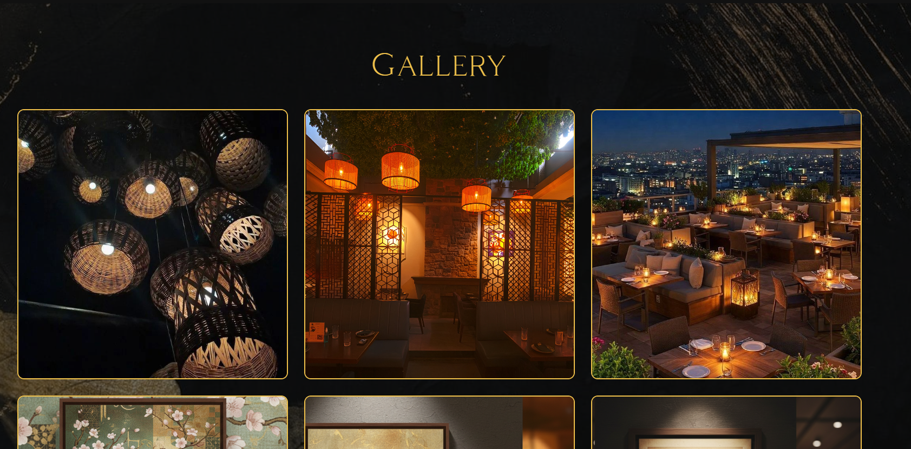

# 🍜 ZENSHI – The Taste of Asia

ZENSHI is a modern and responsive restaurant website inspired by Pan-Asian cuisine. This project was built to improve frontend development skills and create a visually appealing, user-friendly restaurant experience.

## 🚀 Features

- Responsive navigation bar
- Modern landing page UI
- Interactive menu section
- Reservation/booking section
- Gallery showcase
- Contact section

## 🛠 Tech Stack

- HTML5
- CSS3
- JavaScript

## 🎯 What I Learned

Through this project, I improved my understanding of:

- Responsive web design
- Frontend UI structuring
- JavaScript interactions
- Better webpage organization

## 📸 Screenshots

### Homepage

### Menu Section

### Reservation Section

### Gallery

## 🔗 Live Demo

(https://aman-flashiii.github.io/ZENSHI-Website/)

## 👨‍💻 Author

Aman
